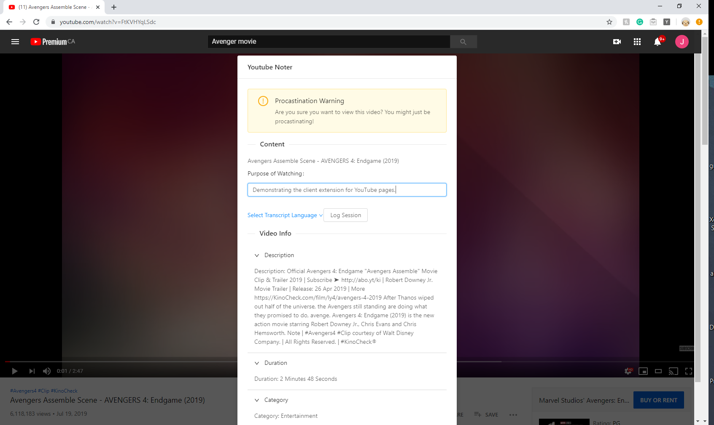
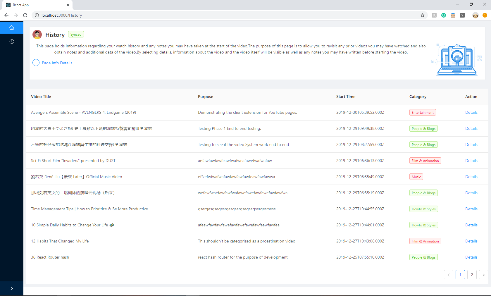
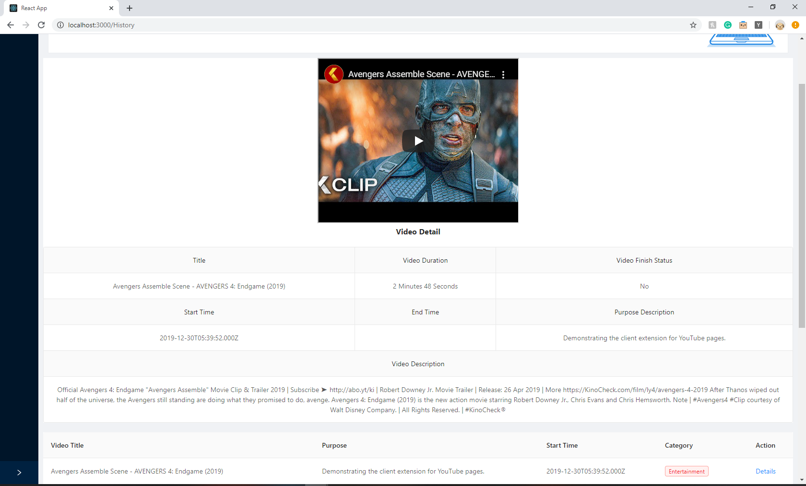
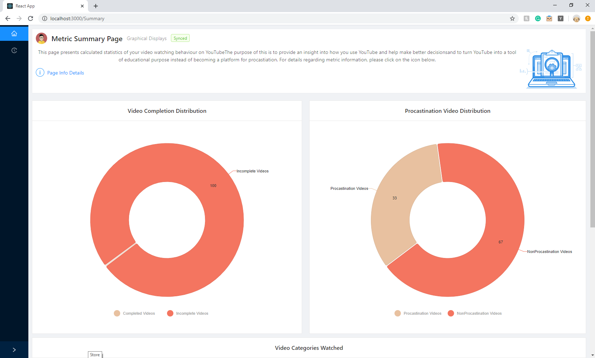
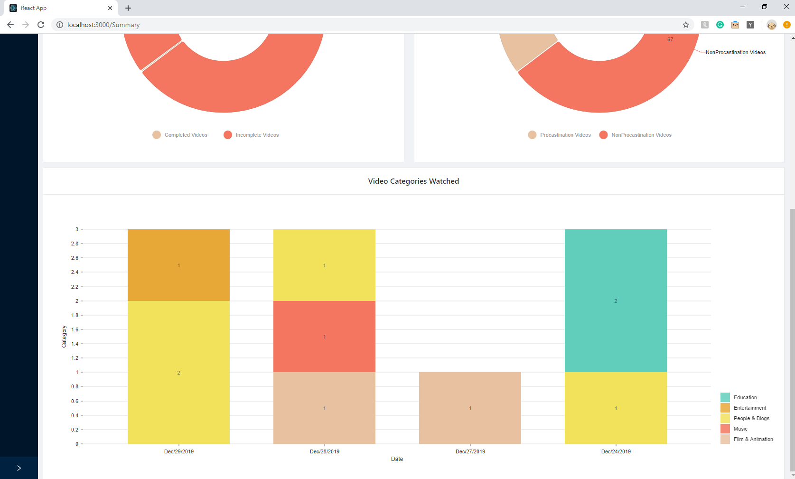

# YoutTube Focus Reminder
This Web-App is the client-facing component of the project "Youtube Focus Reminder". 

### Component-1 (Server): https://github.com/jameskanCa/Youtube-Server

### Component-2 (Chrome Extension): You're viewing Chrome Extension component.

### Component-3 (Web App): https://github.com/jameskanCa/youtubeappwebpage

## Project Description: 
The purpose of this project is to turn YouTube into a useful tool instead of becoming a mode of distraction. Also, it is to provide insight into each individual's video-watching habit.

## Project Architecture:
Client extension and client web-app communicate with the server API endpoints to store and retrieve data. User information is stored according to their Google ID in the MongoDB database. Client extension operates only when a user is viewing videos on YouTube, collecting video metadata as well as information user inputs when the modal pops up to indicate a video may be of distracting nature. 

Web-App communicates through REST calls to the server API to retrieve user data, including watch history and video metadata. This data gets used to calculate metrics such as % of videos watched that are distracting and non-educational. A breakdown of the user's video categories per day can be displayed. 

# Project Images
### Client Extension Modal that warns users a video is of distracting nature.

### Example of watch history table collected from users. (Category Green = Non-distracting. Red = Distracting)

### Example of detailed metadata shown of a vidoe watched by users.

### Example of graphical metric data.

### Example of user daily video category breakdown. 

